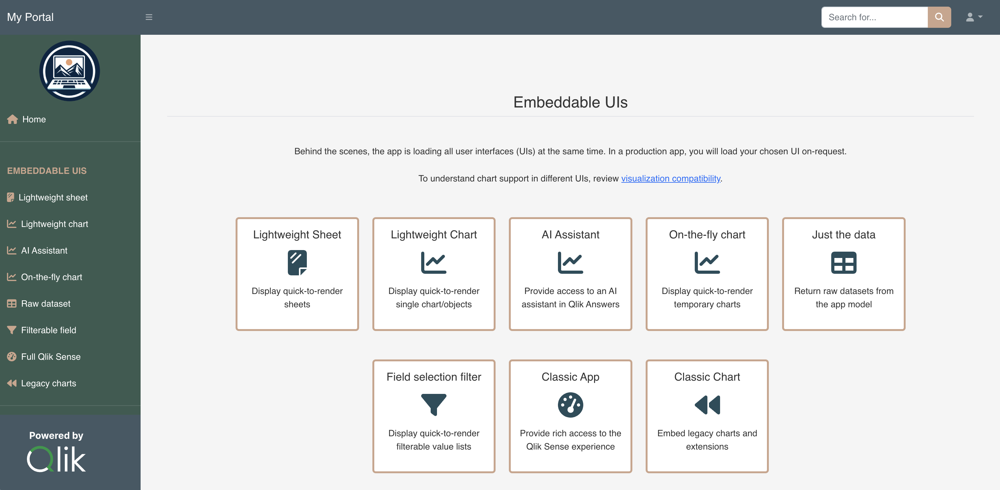

# Embed Qlik Sense using qlik-embed and emulated SSO (Single Sign On) via OAuth impersonation

> [!IMPORTANT]
> This project is not production ready. It is structured for learning and evaluation of the qlik-embed project with a
simple OAuth impersonation configuration.
> For a production app, you should first review the [guiding principles for OAuth impersonation](https://qlik.dev/authenticate/oauth/guiding-principles-oauth-impersonation/) and understand how to use
[qlik-embed](https://qlik.dev/embed/qlik-embed/) and [qlik/api](https://qlik.dev/toolkits/qlik-api/). You should also
use HTTPS rather than HTTP for your project.

> [!NOTE]
> Consider first reviewing the associated [embed Qlik Analytics tutorial](https://qlik.dev/embed/qlik-embed/quickstart/qlik-embed-impersonation-tutorial/) before you begin.

## Introduction

The goal of this project is to show how to easily deploy analytics into your solution with a seamless login
experience for your users, even when your web app or portal doesn't have a backend identity provider for users to authenticate to directly. This project leverages Qlik's qlik-embed, qlik/api, and OAuth machine-to-machine impersonation
capabilities.



It showcases several embedding techniques, such as:

- qlik-embed `classic/app`: full sheet embed supporting the native experience
- qlik-embed `analytics/sheet`: lightweight full sheet embed
- qlik-embed `classic/chart`: load legacy charts in a similar manner to `classic/app`
- qlik-embed `field`: lightweight way to render a list box containing dimension values
- qlik-embed `selections`: lightweight way to render a full Qlik Sense selections bar
- qlik-embed retrieval of hypercube data from an existing object
- qlik/api retrieval of hypercube data without an existing qlik-embed object

## Prerequisites

- [Node.js](https://nodejs.org)
- An [OAuth M2M client](https://qlik.dev/authenticate/oauth/create/create-oauth-client/) for the backend calls, configured with:
    - Scopes: `user_default`, `admin_classic`
    - Allowed origins: `http://localhost:3000`
- An [OAuth M2M impersonation client](https://qlik.dev/authenticate/oauth/create-oauth-client-m2m-impersonation/) for the frontend calls, configured with:
    - Scopes: `user_default`
    - Allowed origins: `http://localhost:3000`

## Step 1. Set up your local project

### Method 1: Clone the GitHub repository

Clone the GitHub repository using the `git clone` command.

```shell
git clone https://github.com/qlik-oss/qlik-cloud-embed-oauth-impersonation.git
```

### Method 2: Download and extract the project files

Alternatively, you can download and extract the project files.

1. On the project's [GitHub page](https://github.com/qlik-oss/qlik-cloud-embed-oauth-impersonation), click **Code**.
1. Select **Download ZIP**.
1. Extract the content of the ZIP file in the folder of your choice.

## Step 2. Upload the demo Qlik Sense app

1. Upload the [demo Qlik Sense app](./qlik_app/Consumer%20Sales.qvf) to your tenant.
1. Open the app and copy the ID (it will be a GUID similar to `946d5af4-e089-42d3-9ba7-1d21adb68472`).
    > This demo contains some hard-coded values which will only work with this Qlik Sense app.
1. Move the app into a new `shared` space.
1. Edit the space configuration to provide `Can view` access to anyone in the tenant.
    > In a production deployment, you would verify that the logged-in user has access to the app.

## Step 3. Set up environment variables

1. Rename the `template.env` file to `.env.dev`.
1. Edit the `.env.dev` file with values that match your Qlik Cloud deployment:
    - `OAUTH_BACKEND_CLIENT_ID` and `OAUTH_BACKEND_CLIENT_SECRET`: enter the credentials obtained when you created the OAuth M2M client in the Administration activity center.
    - `OAUTH_FRONTEND_CLIENT_ID` and `OAUTH_FRONTEND_CLIENT_SECRET`: enter the credentials obtained when you created the OAuth M2M impersonation client in the Administration activity center.
      > Keep these secrets safe as they provide wide access to your tenant.
    - `SESSION_SECRET`: enter a random long string that will be used to sign the session ID cookie.
    - `TENANT_URI`: enter the hostname of the Qlik Cloud tenant against which the app will run, such as
    `z29kgagw312sl0g.eu.qlikcloud.com`.
    - `APP_ID`: enter the app GUID for the Qlik Sense app you uploaded to your tenant (used for analytics/sheet, classic/app, analytics/chart and classic/chart examples).
    - `SHEET_ID`: leave as is if using the provided demo app, otherwise change to a sheet ID from your app (used for the analytics/sheet and classic/app examples).
    - `OBJECT_ID`: leave as is if using the provided demo app, otherwise change to a chart (object) ID from your app (used for the analytics/chart and classic/chart examples).
    - `FIELD_ID`: leave as is if using the provided demo app, otherwise change to the name of a field from your app (used for the filter pane example).

## Step 4. Install the dependencies and run the app

1. Open a terminal window and navigate to the folder containing the project files you extracted or cloned.

   ```shell
    cd <project-folder>
    ```

1. Install the project dependencies.

   ```shell
    npm install
    ```

1. Start the development server:

   ```shell
    npm run dev
    ```

1. Open <http://localhost:3000> in your browser.

You should see your web app running locally.
