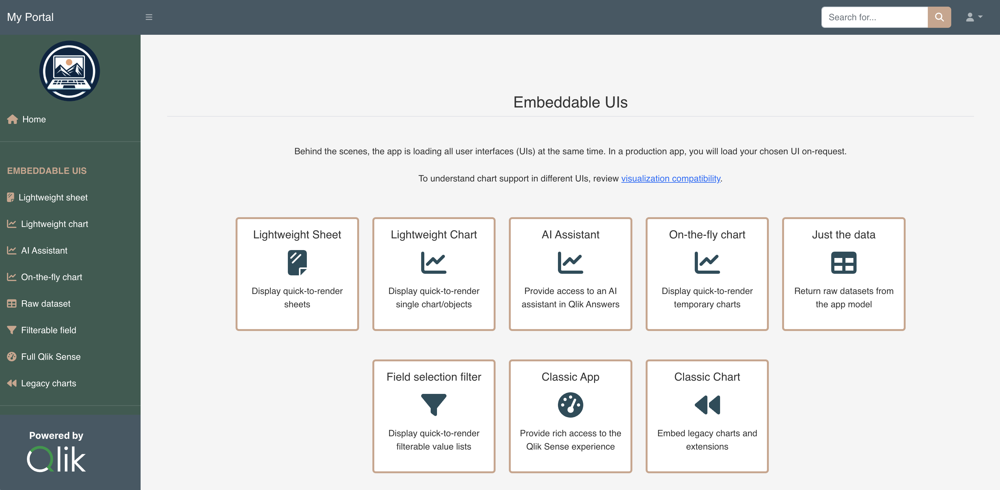

[](https://github.com/qlik-oss/qlik-cloud-embed-oauth-impersonation/actions/workflows/ci-tests.yml)

# Embed Qlik Sense & Qlik Answers using qlik-embed and emulated SSO (Single Sign On) via OAuth impersonation

> [!IMPORTANT]
> This project is not production ready. It is structured for learning and evaluation of the qlik-embed project with a
simple OAuth impersonation configuration.
> For a production app, you should first review the [guiding principles for OAuth impersonation](https://qlik.dev/authenticate/oauth/guiding-principles-oauth-impersonation/) and understand how to use
[qlik-embed](https://qlik.dev/embed/qlik-embed/) and [qlik/api](https://qlik.dev/toolkits/qlik-api/). You should also
use HTTPS rather than HTTP for your project.

> [!NOTE]
> Consider first reviewing the associated [embed Qlik Analytics tutorial](https://qlik.dev/embed/qlik-embed/quickstart/qlik-embed-impersonation-tutorial/) before you begin.

## Introduction

The goal of this project is to show how to easily deploy analytics & AI into your solution with a seamless login
experience for your users, even when your web app or portal doesn't have a backend identity provider for users to authenticate to directly. This project leverages Qlik's qlik-embed, qlik/api, and OAuth machine-to-machine impersonation
capabilities.



It showcases several embedding techniques, such as:

- qlik-embed `classic/app`: full sheet embed supporting the native experience
- qlik-embed `analytics/sheet`: lightweight full sheet embed
- qlik-embed `classic/chart`: load legacy charts in a similar manner to `classic/app`
- qlik-embed `analytics/chart`: lightweight charts in a similar manner to `analytics/sheet`
- qlik-embed `analytics/chart` on-the-fly: lightweight charts generated on-the-fly (e.g. the chart doesn't need to be in the Qlik Sense app, it is defined in the web app instead)
- qlik-embed `ai/agentic-assistant`: provides access to the Qlik Answers agentic assistant that works across both structured and unstructured data
- qlik-embed `ai/assistant` (legacy): provides access to the legacy unstructured AI assistants in Qlik Answers
- qlik-embed `analytics/field`: lightweight way to render a list box containing dimension values
- qlik-embed `analytics/selections`: lightweight way to render a full Qlik Sense selections bar
- qlik-embed retrieval of hypercube data from an existing object
- qlik/api retrieval of hypercube data without an existing qlik-embed object

## Prerequisites

- [Node.js](https://nodejs.org) version 20 or higher
- An [OAuth M2M client](https://qlik.dev/authenticate/oauth/create/create-oauth-client/) for the backend calls, configured with:
    - Scopes: `user_default`, `admin_classic`
    - Allowed origins: `http://localhost:3000`
- An [OAuth M2M impersonation client](https://qlik.dev/authenticate/oauth/create-oauth-client-m2m-impersonation/) for the frontend calls, configured with:
    - Scopes: `user_default`
    - Allowed origins: `http://localhost:3000`

## Step 1. Set up your local project

### Method 1: Clone the GitHub repository

Clone the GitHub repository using the `git clone` command.

```shell
git clone https://github.com/qlik-oss/qlik-cloud-embed-oauth-impersonation.git
```

### Method 2: Download and extract the project files

Alternatively, you can download and extract the project files.

1. On the project's [GitHub page](https://github.com/qlik-oss/qlik-cloud-embed-oauth-impersonation), click **Code**.
1. Select **Download ZIP**.
1. Extract the content of the ZIP file in the folder of your choice.

## Step 2a. Upload the demo Qlik Sense app

1. Upload the [demo Qlik Sense app](./qlik_app/Consumer%20Sales.qvf) to your tenant.
1. Open the app and copy the ID (it will be a GUID similar to `946d5af4-e089-42d3-9ba7-1d21adb68472`).
    > This demo contains some hard-coded values which will only work with this Qlik Sense app.
1. Move the app into a new `shared` space.
1. Edit the space configuration to provide `Can view` access to anyone in the tenant.
    > In a production deployment, you would verify that the logged-in user has access to the app.

## Step 2b. (Optional) Create a Qlik Answers Assistant

1. Follow the [Qlik Answers help documentation](https://help.qlik.com/en-US/cloud-services/Subsystems/Hub/Content/Sense_Hub/QlikAnswers/Qlik-Answers.htm)
   to set up a new Knowledgebase and Assistant, and index the knowledgebase data
   ready for users to ask questions.
2. Provide `View` and `Can consume data` roles to all users in the tenant for the
   spaces containing the knowledgebase, assistant, and any data connections used
   by the knowledgebase.
3. Note the assistant GUID — you can use it as either `AGENTIC_ASSISTANT_ID` (for
   the agentic assistant UI `ai/agentic-assistant`) or `ASSISTANT_ID` (for the
   legacy assistant UI `ai/assistant`), or both if you have separate assistants.

## Step 3. Set up environment variables

1. Rename the `template.env` file to `.env`.
2. Edit the `.env` file with values that match your Qlik Cloud deployment:
    - `OAUTH_BACKEND_CLIENT_ID` and `OAUTH_BACKEND_CLIENT_SECRET`: enter the credentials obtained when you created the OAuth M2M client in the Administration activity center.
    - `OAUTH_FRONTEND_CLIENT_ID` and `OAUTH_FRONTEND_CLIENT_SECRET`: enter the credentials obtained when you created the OAuth M2M impersonation client in the Administration activity center.
      > Keep these secrets safe as they provide wide access to your tenant.
    - `TENANT_URI`: enter the hostname of the Qlik Cloud tenant against which the app will run, such as
    `z29kgagw312sl0g.eu.qlikcloud.com`.
    - `APP_ID`: enter the app GUID for the Qlik Sense app you uploaded to your tenant (used for analytics/sheet, classic/app, analytics/chart and classic/chart examples).
    - `AGENTIC_ASSISTANT_ID`: enter the GUID of the Qlik Answers agentic assistant for the `ai/agentic-assistant` UI, or leave blank to omit.
    - `ASSISTANT_ID`: enter the GUID of the Qlik Answers Assistant you wish to embed with the legacy `ai/assistant` UI, or leave blank to omit.
3. (Optional) If you are using an app other than the provided Qlik Sense application,
   configure the following:
    - `SHEET_ID`: a sheet ID from your app (used for the analytics/sheet and classic/app examples).
    - `OBJECT_ID`: a chart (object) ID from your app (used for the analytics/chart and classic/chart examples).
    - `FIELD_ID`: a field from your app (used for the filter pane example).
    - `HYPERCUBE_DIMENSION`: a field to use as a dimension for the hypercube (data) example.
    - `HYPERCUBE_MEASURE`: a measure expression to use as a measure for the hypercube (data) example.
    - `MASTER_DIMENSION`: a master dimension name used for the on-the-fly example.
    - `MASTER_MEASURE`: a master measure name used for the on-the-fly example.
4. (Optional) If you wish to further configure your web app and integration, update:
   - `SESSION_SECRET`: enter a random long string that will be used to sign the session.
   - `PORT`: specify the port the web app will be hosted app when you run it with `npm start`.
   - `USER_PREFIX`: enter the prefix that new users will be created with when logging into the web app.

## Step 4. Install the dependencies and run the app

1. Open a terminal window and navigate to the folder containing the project files you extracted or cloned.

   ```shell
    cd <project-folder>
    ```

1. Install the project dependencies.

   ```shell
    npm install
    ```

1. Start the development server:

   ```shell
    npm start
    ```

1. Open <http://localhost:3000> in your browser.

You should see your web app running locally.

## How it works

This demo uses **two separate OAuth clients** to keep credentials scoped to their intended purpose:

```
Browser                     Node.js server (server.js)          Qlik Cloud
  │                                   │                               │
  │  1. POST /login (email)           │                               │
  │──────────────────────────────────>│                               │
  │                                   │  2. Look up / create user     │
  │                                   │   (Backend M2M client)        │
  │                                   │──────────────────────────────>│
  │                                   │<──────────────────────────────│
  │  3. Serve home.html               │                               │
  │<──────────────────────────────────│                               │
  │                                   │                               │
  │  4. POST /access-token            │                               │
  │──────────────────────────────────>│                               │
  │                                   │  5. Mint impersonation token  │
  │                                   │   (Frontend M2M client)       │
  │                                   │──────────────────────────────>│
  │                                   │<──────────────────────────────│
  │  6. Token returned to browser     │                               │
  │<──────────────────────────────────│                               │
  │                                   │                               │
  │  7. qlik-embed uses token to      │                               │
  │     render analytics directly     │                               │
  │──────────────────────────────────────────────────────────────────>│
```

| OAuth client | Configured with | Used for |
|---|---|---|
| **Backend M2M** (`admin_classic`, `user_default`) | `OAUTH_BACKEND_CLIENT_ID` / `SECRET` | Server-side: look up and create Qlik users. Credentials **never** leave the server. |
| **Frontend M2M impersonation** (`user_default`) | `OAUTH_FRONTEND_CLIENT_ID` / `SECRET` | Server-side: mint short-lived tokens that impersonate a specific user. Tokens are passed to the browser for use by `qlik-embed`. |

The browser never sees the OAuth client secrets. It only ever receives a short-lived access token that it passes to `qlik-embed` via the `data-get-access-token` callback.

## Project structure

```
├── server.js               # Express backend: auth flow, user provisioning, API routes
├── template.env            # Copy to .env and fill in your credentials
├── src/
│   ├── home.html           # Main dashboard — all qlik-embed examples in one page
│   ├── login.html          # Demo login form (email only, no real auth)
│   ├── js/
│   │   └── script.js       # Frontend helpers: getAccessToken, getConfig, getSheets, getHypercube
│   └── css/
│       └── qlik-embed-style.css  # Layout styles for embed containers
└── tests/                  # Playwright end-to-end tests
```

**Key entry points for reading the code:**

- `server.js` lines 45–93 — the two OAuth configs and the `getFrontendHostConfig()` helper
- `server.js` `POST /access-token` — how a user-scoped token is minted on each request
- `server.js` `GET /` — how a Qlik user is looked up or created on first login
- `src/js/script.js` `getAccessToken()` — the callback `qlik-embed` calls for tokens
- `src/home.html` `updateHeaders()` — how `qlik-embed` is loaded and configured
- `src/home.html` `updateQlikEmbedTags()` — how app/sheet/object IDs are set at runtime

## Testing

The project includes [Playwright](https://playwright.dev) end-to-end tests that verify authentication and content rendering. Tests require a configured `.env` file pointing at a live Qlik Cloud tenant.

```shell
# Run all tests (headless)
npm test

# Watch tests run in a real browser
npm test -- --headed

# Open the interactive Playwright UI
npm test -- --ui

# View the HTML test report after a run
npm run test:report
```
